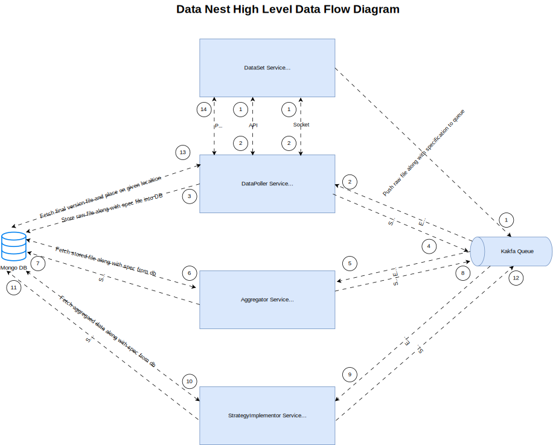

# Data-Nest Application

### This application is for demonstration how design patterns can be used for big size project where requirement is to pull data from multiple sources like API, SFT, WebSocket and data would be in multple formats ex. CSV, EXLS, HTML & JSON and if any new format required to support can be plug and play easily.

curl --location --request GET 'http://localhost:8081/files/upload/1/1'